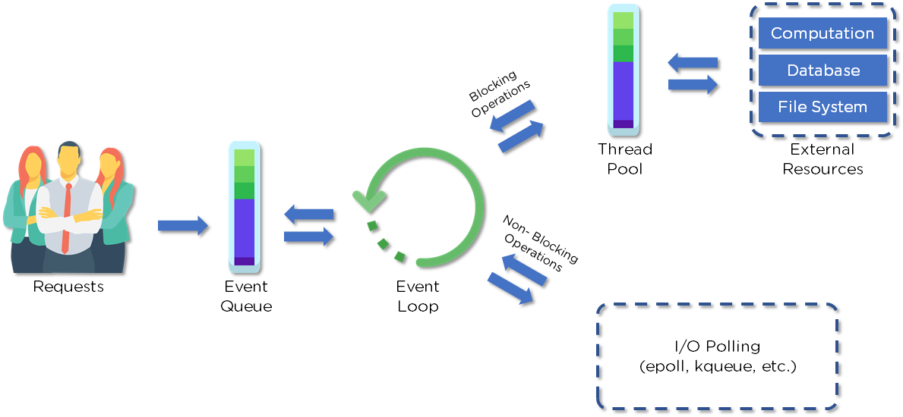

Node.js 관련 개념
===============

## 1. Node.js란?
서버 측에서 웹 응용 프로그램을 만드는 데 사용되는 오픈 소스, 크로스 플랫폼, **자바스크립트 런타임 환경**(프레임워크 ❌) 및 라이브러리. 비동기 방식을 사용하며 이벤트 기반의 모델을 사용하기 때문에 다음과 같은 개발에 적합👍🏻 싱글 스레드 기반
* 실시간 작업
* 대화형 프로젝트 개발
* 데이터 집약적인 애플리케이션 개발 
* 스트리밍 애플리케이션
* 마이크로 서비스 아키텍처(MSA)

## 2. 비동기
하나의 요청 처리가 끝나기 전에 제어권을 다음 요청에게 넘기는 것. 요청의 처리는 다른 곳에 맡기고 다음 요청을 처리한다. I/O non-blocking 방식
* block/non-block은 코드의 제어권에 관심
    - blocking: 호출된 함수가 자신의 할 일을 다 마칠 때까지 호출한 함수에게 제어권을 넘겨주지 않을 때(I/O 작업이 진행되는 동안 작업이 중단된 채 대기)
    - non-blocking: 호출된 함수가 자신의 할 일을 다 마치기 전에 호출한 함수에게 제어권을 넘겨줌으로써 다른 일을 할 수 있을 때(I/O 작업이 진행되는 동안 작업이 멈추지 않고 다음 작업 수행)
* 동기/비동기는 수행 결과에 관심
    - 동기: 호출된 함수의 결과를 호출한 함수가 신경 쓸 때(요청을 하고 완료를 할 때까지 기다리는 방식, 백그라운드 작업 완료 여부를 계속 확인)
    - 비동기: 호출된 함수의 결과를 콜백을 이용하여 호출된 함수가 알아서 처리할 때(요청을 하고 바로 제어권을 돌려 받는 방식, 요청만 하고 다시 프로그램을 처리하다가 완료 이벤트가 발생하면 미리 지정한 처리를 진행한다.)

## 3. 이벤트 루프
이벤트가 대기하는 메인 루프! 비동기 콜백을 처리한다. Node.js 기반으로 만들어진 서버가 가동되면 변수들을 초기화하고 함수를 선언하고 이벤트가 일어날 떄까지 기다린다. 이벤트가 감지되었을 시 callback 함수를 호출한다. 
<!--  -->

</img>

* 클라이언트는 웹 응용 프로그램과 상호 작용하기 위해 웹 서버에 요청을 보낸다. 요청은 non-blocking or blocking
* Node.js는 들어오는 요청을 검색하여 이벤트 큐에 추가한다.
* 요청은 이벤트 루프를 통해 하나씩 전달된다. 요청이 외부 리소스를 필요로 하지 않을 만큼 간단한지 확인.
* 이벤트 루프는 I/O Polling과 같은 간단한 요청(non-blocking)을 처리하고 해당 클라이언트에 응답을 반환한다.
* Thread pool의 single thread가 단일 복합 요청에 할당된다. 이 스레드는 계산, 데이터베이스, 파일 시스템 등과 같은 외부 리소스에 액세스하여 특정 차단 요청을 완료한다.
* 작업이 완전히 수행되면 응답이 이벤트 루프로 전송되고 해당 응답은 다시 클라이언트로 전송된다.

### Node.js가 single thread인 이유는?
비동기 처리를 위한 단일 스레드. 일반적인 웹로드에서 단일 스레드에서 비동기 처리를 수행하면 일반적인 스레드 기반 구현과 달리 더 많은 성능과 확장성을 얻을 수 있기 때문이다👍🏻

### 📌이벤트와 콜백함수의 차이점
콜백함수는 비동기식 함수에서 결과를 반환할 때 호출하지만
이벤트 핸들링은 observer 패턴에 의해 작동된다.
이벤트를 대기하는 함수들이 observer 역할을 하며, 이 observer들이 이벤트를 기다리다가 이벤트가 실행되면 이벤트를 처리하는 함수가 실행된다. 

### 이벤트 기반 프로그래밍
이벤트를 사용하여 다양한 기능을 트리거한다. 이벤트는 키를 입력하거나 마우스 버튼을 클릭하는 것과 같은 모든 것이 될 수 있다. 요소에 이미 등록된 콜백 함수는 이벤트가 트리거될 때마다 실행된다. 

### 📌observer pattern
객체의 상태 변화를 관찰하는 관찰자들, 즉 observer들의 목록을 객체에 등록하여 상태 변화가 있을 때마다 메서드 등을 통해 객체가 직접 목록의 각 observer에게 통지하도록 하는 디자인 패턴. 
* 주로 분산 이벤트 핸들링 시스템을 구현하는 데 사용
* MVC 패턴에서 model과 view 사이를 느슨히 연결(loosely coupled)하기 위해 사용
* 대표적으로 모델에서 일어나는 이벤트를 통보 받는 observer는 view의 내용을 바꾸는 스위치를 작동시킴

## 4. ✨Callback function✨
콜백 함수란 다른 함수의 인자로서 이용되는 함수, 어떤 **이벤트에 의해 호출**되어지는 함수
Node.js에서 가장 핵심적인 부분
일을 다른 객체에게 시키고, 그 일이 끝나는 것을 기다리는 것이 아니라 그 객체가 나를 다시 부를 때 까지 내 할 일을 하고 있는 것
#### called at the back!

### 📌callback hell
콜백 지옥. 콜백 함수 내부에 콜백 함수가 연쇄적으로 존재하는 경우. 집중적으로 중첩되고, 읽을 수 없으며, 관리할 수 없는 콜백의 결과로 코드를 읽고 디버그하기가 어려워진다. 비동기 논리의 부적절한 구현으로 인해 콜백 지옥이 발생한다. 

### 📌callback hell 대안 - 흐름 제어
* promise: ES6부터 공식적으로 포함된 흐름 제어 패턴, 내부적으로 예외처리 구조를 가진다. 
    + promise의 3가지 상태
        - pending: 최초로 생성된 시점의 상태
        - fulfilled: 직업이 성공적으로 완료된 상태
        - rejected: 직업이 실패한 상태
    + promise chaining: 여러 개의 프로미스를 연결하여 사용
        - then API: 비동기 작업 완료 시 결과에 따라 함수 호출
        - catch API: 체이닝 형태로 연결된 상태에서 비동기 작업이 중간에 에러가 났을 때 호출
* async/await: ES7부터 지원하는 자바스크립트 비동기 패턴. 정확한 promise 코드를 한 번 더 깔끔하게 줄여줌. 기존의 비동기 처리 방식인 콜백함수와 promise의 단점을 보완하여 읽기 좋은 코드로 만들어 줌. 동기 코드와 매우 유사하다.
    + Async: promise를 사용하지 않고도 효과적으로 콜백 헬 해결. Async는 암묵적으로 promise를 반환
    + Await: promise를 기다림(성공 or 실패). Async로 정의된 내부에서만 사용 가능

### Libuv
Node.js 에서 비동기 처리를 담당하는 라이브러리

## 5. 모듈
독립된 기능을 하는 함수나 변수들의 집합. 모듈 자체가 하나의 프로그램이면서 다른 프로그램의 부품으로 사용할 수 있음. 재사용에 용이. Node.js 애플리케이션에 모듈을 포함하려면 모듈 이름이 포함된 괄호와 함께 require() 함수를 사용

### Node.js에서는 각 파일을 모듈화 👉 자신만의 독립적인 실행 영역(scope)
* 내장 모듈: 노드에서 기본적으로 제공해주는 모듈
    - crypto: 문자열을 암호화, 복호화, 해싱하는 모듈
    - file system module: 파일 시스템에 접근하는 모듈

<pre><code>const http = require('http');
</code></pre>

## 6. npm
Node.js의 모든 패키지와 모듈을 관리하는 Node Package Manager의 약자이다.
* node.js 패키지/모듈에 대한 온라인 저장소를 제공
* node.js 패키지를 설치하기 위한 command-line 유틸리티를 제공하고 node.js 버전 및 종속성도 관리

## 7. Express
웹 및 모바일 애플리케이션 개발을 위한 다양한 기능을 제공하는 유연한 node.js 웹 애플리케이션 **프레임워크**. HTTP 요청에 대해 라우팅 및 미들웨어 기능 제공
* express 구조
    - bin/www : 서버를 실행하는 스크립트. 프로젝트에 할당되는 포트 번호를 바꿀 수 있음
    - public/ : 각종 리소스들을 포함(ex. 이미지, CSS, JS 파일 등) * 앱에서는 건들 일 없음!
    - routes/ : 페이지 라우팅과 관련된 파일 저장. URL별로 실행되는 실제 서버 로직
    - views/ : jade, ejs 등 템플릿 파일을 모아둠. 웹 서버 사용 시 해당 폴더의 파일들을 사용해서 렌더링 * 앱 서버에서는 사용 안함.
    - /app.js : 프로젝트의 중심. 핵심적인 서버 역할. 미들웨어 관리가 이루어짐. 라우팅의 시작점

## 8. package.json & package-lock.json
package.json - 특정 프로젝트에 대한 메타 데이터를 보유. npm 의존성 파일들. 현재 프로젝트에 사용된 모듈을 설치하는데 필요한 내용을 담고 있다. (버전 정보도 포함) npm install을 하면 해당 파일에 있는 파일들을 전부 설치. 특정 npm 모듈을 설치하면 자동으로 추가됨
package-lock.json - 개발자들이 동일한 node_modules 트리를 생성해서 같은 의존성을 설치할 수 있도록 보장해준다. 정확한 버전 정보를 저장해주기 때문에 협업 시 다른 버전 정보로 생기는 문제가 발생하지 않도록 도와줌!!

## 9. ROUTING
URI(또는 경로) 및 특정한 HTTP 요청 메소드 (GET, POST 등)인 특정 엔드포인트에 대한 클라이언트 요청에 애플리케이션이 응답하는 방법을 결정. Express에서는 app.js에서 모든 요청 경로를 처리하지 않고, routes 폴더 아래의 index.js를 기준으로 파일들을 추가하며 정리.

## 10. CORS
Cross Origin Resource Sharing: 도메인 또는 포트가 다른 서버의 자원을 요청하는 매커니즘

## 11. closure/클로저
함수 내부에 작성된 함수

## 12. ORM
Object-Relational-Mapping: MySQL을 쉽게 다룰 수 있도록 도와주는 라이브러리. 간단하게 객체와 관계형 데이터베이스의 관계를 매핑해주는 도구. sequelize를 사용하면 JS 코드로 MySQL을 제어할 수 있음.

--------

## REST API
정보들이 주고받아지는데 있어서 개발자들 사이에 널리 쓰이는 일종의 형식 기술이나 제품이 아니라 형식이기 때문에 무슨 언어를 쓰든 어떤 프레임워크를 쓰든 그 폼에 맞춰서 쓰기만 하면 된다. 

* API: 기계와 인간 사이의 소통 창구

REST의 가장 큰 특성은 각 요청이 어떤 동작이나 정보를 위한 것인지를 그 요청의 모습 자체로도 추론이 가능하다는 점✨ 즉, RESTful하게 만든 API는 요청을 보내는 주소만으로도 대략 이게 무슨 요청을 하는 것인지 파악이 가능.
서버에 API로 요청을 보낼 때는 HTTP 라는 통신 규약에 따라 신호를 전송한다.
택배에 비유했을 때, 택배를 보내는 방법에 일반 우편, 등기, 택배 등 다양한 방식이 있듯이 HTTP 전송 방법에도 다양한 METHOD가 있다.
* GET
* POST
* PUT/PATCH
* DELETE

소포가 편지보다 더 많은 내용을 보낼 수 있듯이 POST, PUT, PATCH에는 body라는 주머니가 있어서 GET, DELETE 보다 정보를 많이 그리고 비교적 안전하게 감춰서 실어 보낼 수 있음.

PUT과 PATCH는 일반적으로 데이터를 변경할 때 사용하는데 보통은 PUT을 많이 사용한다.

이때, 통상적으로는 PUT은 데이터를 통째로 갈아치울 때, PATCH는 일부만 갈아치울 때 사용한다.

### ✨GraphQL API를 사용하면 여러 번 네트워크 호출을 할 필요 없이, 한 번의 네트워크 호출로 처리 가능✨ 
_나중에 따로 GraphQL에 대해 다루는 페이지를 만들도록 하겠다👩🏻‍💻 (JS 생태계도 같이😉)_

## MSA
Monolithic architecture: 소프트웨어의 모든 구성 요소가 한 프로젝트에 통합되어 있는 형태(현재 🥕이 제공하는 형태)

아직까지는 많은 소프트웨어가 모놀리틱 형태로 구현되어 있고, 소규모 프로젝트에는 모놀리틱 아키텍처가 훨씬 합리적이다. 간단한 구조이고 유지보수가 용이하기 때문이다.

하지만 일정 규모 서비스, 혹은 수백명의 개발자가 투입되는 프로젝트에서 모놀리틱 아키텍처는 뚜렷한 한계를 보인다. 
* 서비스/프로젝트가 커지면 커질수록, 영향도 파악 및 전체 시스템 구조의 파악에 어려움이 있다.
* 빌드 시간 및 테스트 시간, 그리고 배포 시간이 기하급수적으로 늘어나게 된다.
* 서비스를 부분적으로 scale-out 하기가 힘들어진다.
* 부분의 장애가 전체 서비스의 장애로 이어지는 경우가 발생하게 된다.

이때 MSA는 비즈니스 민첩성과 관련이 크다. 서비스나 프로젝트가 크고, 복잡하고, 장기적으로 운영될수록, MSA의 장점이 더욱 드러나게 된다.
+) MSA 이전에도 CBD, SOA 등 모놀리틱을 논리/물리적으로 구조화하기 위한 노력들이 있어 왔다. MSA는 큰 의미에서 SOA의 부분집합으로 여겨짐.

### MSA
각각의 서비스는 그 크기가 작을 뿐, 서비스 자체는 하나의 모놀리틱 아키텍처와 유사한 구조를 가진다. 각각의 서비스는 독립적으로 배포가 가능해야 한다. 각각의 서비스는 다른 서비스에 대한 의존성이 최소화 되어야 한다. 각 서비스는 개별 프로세스로 구동되며, REST와 같은 가벼운 방식으로 통신 되어야 한다.

MSA는 넷플릭스에서 처음 시작한 아키텍처 구조인데 MSA로 구성하게 될 경우에 하나의 에러가 서비스 전체가 죽지 않게 해주고(장애 지연 방지는 해주어야 함) 기존의 아키텍처 인터페이스에 맞춰서 손쉽게 유지 보수할 수 있다는 장점이 있다. 비즈니스 기능마다 서버랑 데이터베이스를 따로 분리하고 API가 서로를 통신하는 구조