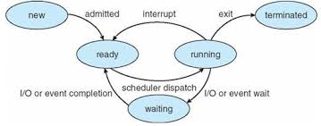
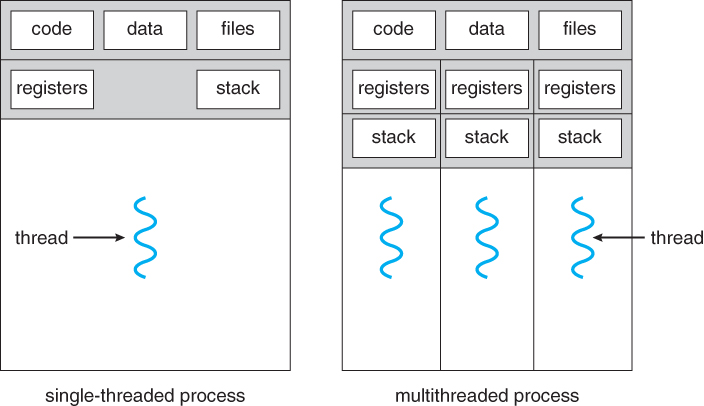

### 프로세스
실행중인 프로그램. 실행 파일이 메모리에 적재될 때 프로그램이 프로세스가 된다.
- 프로세스는 텍스트 섹션으로 알려진 프로그램 코드 이상의 무엇이다. 프로세스는 또한 프로그램 카운터의 값과 처리기 레지스터의 내용으로 대표되는 현재 활동을 포함한다.
- 프로세스는 일반적으로 함수의 매개변수, 복귀 주소와 로컬 변수와 같은 임시적인 자료를 가지는 프로세스 스택과 전역 변수들을 수록하는 데이터 섹션을 포함한다. 또한 프로세스 실행 중에 동적으로 할당되는 메모리인 힙을 포함한다.

#### 메모리 상의 프로세스

- 프로세스는 실행되면서 그 상태가 변한다.

-	각 프로세스는 운영체제에서 프로세스 제어 블록(Process Control Block)에 의해 표현된다. 프로세스 제어 블록은 특정 프로세스와 연관된 여러 정보를 수록하며, 다음과 같은 것들을 포함한다. 
     * 프로세스 상태: 상태는 new, ready, running, waiting, halted 등이다.
     * 프로그램 카운터: 이 프로세스가 다음에 실행할 명령어의 주소를 가리킨다.
     * CPU 레지스터들: CPU 레지스터는 컴퓨터의 구조에 따라 다양한 수와 타입을 가진다. 레지스터에는 누산기, 인덱스 레지스터, 스택 레지스터, 범용 레지스터들과 상태 코드 정보가 포함된다. 프로그램 카운터와 함께 이 상태 정보는, 나중에 프로세스가 계속 올바르게 실행되도록 하기 위해서, 인터럽트 발생 시 저장되어야 한다.
     * CPU 스케줄링 정보: 이 정보는 프로세스 우선순위, 스케줄 큐에 대한 포인터와 다른 스케줄 매개변수들을 포함한다.
     * 메모리 관리 정보
     * 회계 정보
     * 입출력 상태 정보
-	만일 한 스레드가 워드 프로세서 프로그램을 실행 중이면, 실행되는 명령어의 단일 스레드가 존재한다. 이 단일 제어 스레드는 프로세스로 하여금 한 번에 단지 한 가지 일만 실행하도록 허용한다. 예를 들면 사용자는 동일한 프로세스 내에서 문자를 입력하면서 동시에 철자 검사기를 실행할 수 없다. 대부분의 현대 운영체제는 프로세스 개념을 확장하여 한 프로세스가 다수의 실행 스레드를 가질 수 있도록 허용한다. 따라서 프로세스가 한 번에 하나 이상의 일을 수행할 수 있도록 허용한다. 스레드를 지원하는 시스템에서는 PCB는 각 스레드에 관한 정보를 포함하도록 확장된다.

### 스레드
스레드는 CPU 이용의 기본 단위. 스레드는 스레드 ID, 프로그램 카운터, 레지스터 집합, 그리고 스택으로 구성된다. 

- 스레드는 같은 프로세스에 속한 다른 스레드와 코드, 데이터 섹션 그리고, 열린 파일이나 신호와 같은 운영체제 자원들을 공유한다.

#### 싱글 스레드 프로세스와 멀티 스레드 프로세스

- 만일 프로세스가 다수의 제어 스레드를 가진다면, 프로세스는 동시에 하나 이상의 작업들을 수행할 수 있다.

#### 멀티 프로세싱
서버에게 서비스 요청이 들어오면, 프로세스는 그 요청을 수행하기 위해 별도의 프로세스를 생성하는 것. Context switching 과정에서의 오버헤드와 프로세스 사이의 통신이 어렵고 자원적으로 낭비라고 한다. 

#### 멀티 스레딩 
대부분의 프로그램은 하나의 프로세스 안에 여러 개의 스레드로 구성해서 처리하는 방식을 사용한다. 자원을 공유해서 효과적이고, 통신 간 비용이 적다. 

프로세스 안에 여러 스레드를 만들어 나가는 것이 더 효율적이다. 웹 서버가 다중 스레드화 되면, 서버는 클라이언트의 요청을 listen하는 별도의 스레드를 생성한다. 요청이 들어오면, 다른 프로세스를 생성하는 것이 아니라, 요청을 서비스할 새로운 스레드를 생성하고 추가적인 요청을 listen하기 위한 작업을 재개한다.

#### 장점
- 프로세스를 생성하여 자원을 할당하는 시스템 콜이 줄어들어 자원을 효율적으로 관리
- 스레드 사이의 작업량이 작아 context switching이 빠르다. 
- 스레드는 프로세스 내의 stack 영역을 제외한 모든 메모리를 공유하기 때문에 통신의 부담이 적다.
  
#### 단점
- 스레드 하나가 프로세스 내 자원을 망쳐버린다면 모든 프로세스가 종료될 수 있다.
- 자원을 공유하기 때문에 동기화 문제가 발생할 수밖에 없다.

#### Context switching
현재 진행하고 있는 task(process, thread)의 상태를 저장하고 다음 진행할 task의 상태 값을 읽어 적용하는 과정을 말한다.

#### 하이퍼스레딩
한 개의 코어에서 일을 하는 동안 남는 잉여 자원을 활용하는 기술. 코어를 효율적으로 사용하기 위한 기술로 이 기능의 유무에 따라 i5, i7으로 나뉘게 되고 가격차도 많이 난다. 원래는 한 개의 코어는 1쓰레드로써 한가지 일만 할 수 있었지만 HT 기술을 적용하여 한 개의 코어를 2개의 쓰레드로 나눔으로써 두 가지 작업을 동시에 할 수 있게 만든 기술. 한 개의 코어가 2 스레드로 동작하기 때문에 듀얼 코어는 2코어 4 스레드가 되는 것!

많은 스레드가 있다고 한들 그것을 활용하지 못하면 싱글코어나 마찬가지. 내 컴퓨터에서 사용하는 소프트웨어가 다중 코어를 지원해야만 많은 스레드의 CPU가 의미가 있는 것! 단일 작업을 한다고 하더라도 소프트웨어에서 다중 스레드를 지원한다면 스레드가 많은 CPU가 유리하다.
